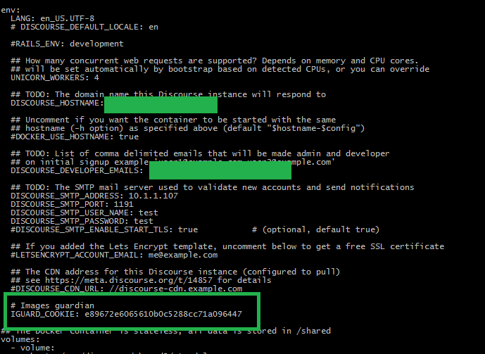
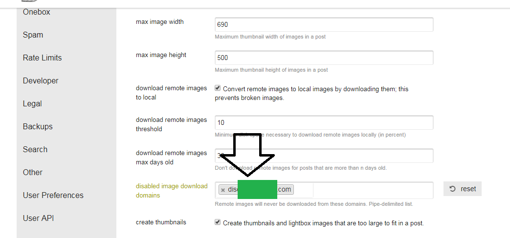
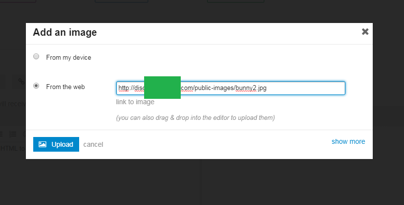
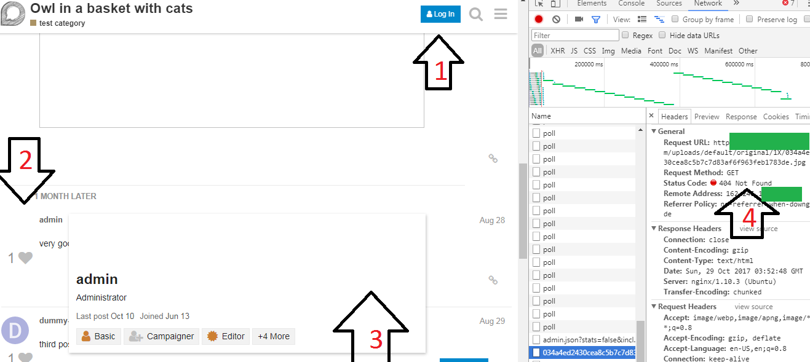
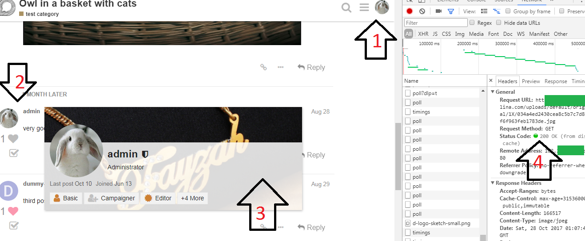
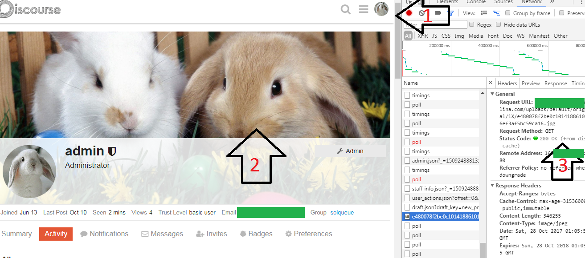
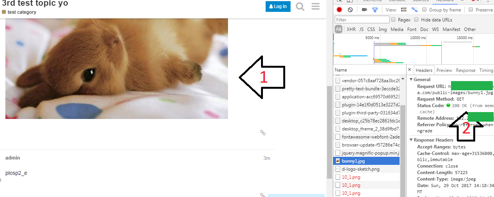

# Discourse Images Guardian

Discourse plugin that would prevent non-authenticated users from accessing uploaded images.

## Installation

1. Add these lines to your container's `app.yml` under `env`. Replace `random-string` with your own.
```
  IGUARD_COOKIE: random-string
```


2. Create `public-images` folder under container's shared directory (default `/var/discourse/shared/standalone`)

3. Add these lines to your container's `app.yml` under `volumes`. Replace `path-to-public-images` with an absolute path to `public-images` folder (default `/var/discourse/shared/standalone/public-images`)
```
  - volume:
      host: path-to-public-images
      guest: /var/www/discourse/public/public-images
```


4. Add these lines to your container's `app.yml` under `hooks`
```
          - git clone https://github.com/muhlisbc/discourse-images-guardian.git
          - erb /var/www/discourse/plugins/discourse-images-guardian/nginx.sample.conf.erb > /var/www/discourse/config/nginx.sample.conf
```


5. Rebuild your container
```
./launcher rebuild app
```

6. Add the forum domain to `disabled image download domains` setting in the admin interface (under `Settings` > `Files`)


## Configuration
You can disable/enable this plugin on-the-fly in the admin interface (enabled by default).


## Usage
When this plugin is enabled, all uploaded images (user's custom avatar, user's card background, user's profile background, image embedded in a post) will return `404` for non logged-in users.

If you want an image to be publicly accessible in a post, you have to upload it to `public-images` folder (default `/var/discourse/shared/standalone/public-images`) and then enter the url (`http(s)://yourdomain.com/public-images/${image-filename}`) while creating a post.


## Screenshot


1. Non logged-in user
2. Can see user default avatar
3. Can't see attached image
4. HTTP response 404


  
1. Logged-in user
2. Can see attached image
3. HTTP response 200



1. Non logged-in user
2. Can't see user's uploaded avatar
3. Can't see user's card background
4. HTTP response 404



1. Logged-in user
2. Can see user's uploaded avatar
3. Can see user's card background
4. HTTP response 200


1. Non logged-in user
2. Can't see user's profile background
3. HTTP response 404



1. Logged-in user
2. Can see user's profile background
3. HTTP response 200



Non logged-in user
1. Can see attached image uploaded to `public-images` folder
2. HTTP response 200


Non logged-in user
1. Can't see attached image
2. HTTP response 404

## License
GPLv2